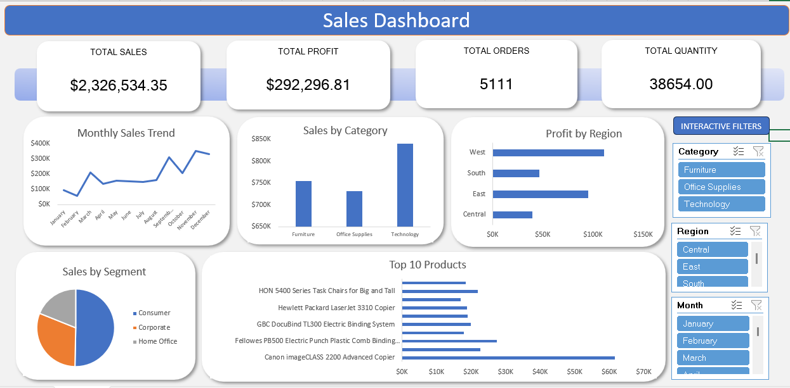

# 📊 Interactive Sales Analytics Dashboard – Excel

## 📌 Project Overview

This project is an interactive Sales Analytics Dashboard built using Microsoft Excel and the Sample Superstore dataset.

The dashboard provides an overview of sales performance, profitability, orders, quantity, regional performance, product performance, categories, and customer segments.

## 📈 Dashboard Features

- 💰 Total Sales
- 📈 Total Profit
- 🛒 Total Orders
- 📦 Total Quantity
- 📅 Monthly Sales Trend
- 🏷️ Sales by Category
- 🌎 Profit by Region
- 👥 Sales by Segment
- 🏆 Top 10 Products
- Interactive Category filter
- Interactive Region filter
- Interactive Month filter

## 🛠️ Tools & Techniques

- Microsoft Excel
- Excel Tables
- PivotTables
- PivotCharts
- Slicers
- KPI calculations
- Data cleaning
- Data analysis
- Data visualization
- Interactive dashboard design

## 📊 Dashboard Preview

## 📂 Project Files

| File | Description |
|---|---|
| `Sales_Dashboard.xlsx` | Complete interactive Excel dashboard |
| `Dashboard.png` | Dashboard preview image |

## 🎯 Skills Demonstrated

- Data cleaning and preparation
- Data aggregation
- KPI development
- Business data analysis
- Data visualization
- Interactive dashboard development
- Excel PivotTables and PivotCharts
- Slicer-based filtering

## 📁 Dataset

The project uses the Sample Superstore dataset containing transaction-level information including orders, products, categories, regions, segments, sales, quantity, and profit.
